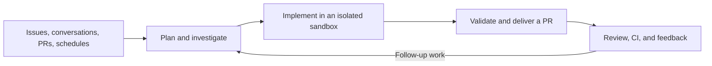

  <a href="https://github.com/langchain-ai/open-swe">
    <picture>
      <source media="(prefers-color-scheme: dark)" srcset="assets/dark.svg">
      <source media="(prefers-color-scheme: light)" srcset="assets/light.svg">
      
    </picture>
  </a>

  <h3>An open-source software factory built on Deep Agents by LangChain.</h3>

  
  
  
  
  

 

Open SWE turns engineering work into a repeatable system: investigate a codebase, implement changes, validate them, and deliver a pull request. It also reviews pull requests, learns repository-specific review preferences, monitors CI, and responds to feedback. Built by LangChain, it is open source and deployable in your infrastructure.

> [!NOTE]
> **Under active development.** Expect breaking changes and rough edges. We’re not accepting issues or external contributions at this time. You’re welcome to explore and fork the code, but correctness, stability, and compatibility are not guaranteed.

## Getting started

- **[Deploy for a team](docs/INSTALLATION.md)** — Set up the backend, dashboard, GitHub and Slack apps, and model credentials. Production standalone Agent Server deployments require a license key.
- **[Develop locally](docs/DEVELOPMENT.md)** — With [mise](https://mise.jdx.dev/) installed, `mise run dev-init` once per checkout, then `mise run dev-ui`. The guide covers credentials, the per-checkout database, hot reload, and a webhook-only tunnel. The Makefile remains for compatibility but is not recommended.
- **[Desktop (experimental)](docs/DEVELOPMENT.md#desktop-app-experimental)** — Work against local repositories. Packaged app releases target macOS; source builds also support Windows and Linux.
- **[Use the CLI](cli/README.md)** — Connect a local directory to an agent on your deployment. Commands execute locally as you, without sandbox isolation.

## What Open SWE does

- **Build:** Investigate repositories, edit code, run focused validation, and open or update pull requests.
- **Parallelize:** Use subagents for research and independent work.
- **Review:** Run on-demand or opt-in automatic reviews, publish findings to GitHub, and learn from historical feedback.
- **Investigate:** Use read-only PR chat to understand a change without implementing changes.
- **Operate:** Schedule recurring tasks and monitor opted-in PRs with `/baby-sit`, diagnosing failures and rerunning only evidence-backed flaky jobs.
- **Customize:** Choose models, reasoning effort, instructions, skills, integrations, and sandbox providers.

Start and continue work from the **dashboard**, **GitHub issues and PR conversations**, or **Slack**. [Linear](docs/INSTALLATION.md#linear) supports issue-comment triggers and replies through a configured Linear MCP connection. Cloud coding follow-ups reuse the thread’s context and sandbox; independent threads can run in parallel.

## How it works

[Deep Agents](https://github.com/langchain-ai/deepagents) supplies planning, filesystem, shell, skills, and subagent primitives. [LangGraph](https://github.com/langchain-ai/langgraph) provides durable execution and thread state. Open SWE adds engineering tools, integrations, authorization, and user interfaces. The graph entrypoints are declared in [`langgraph.json`](langgraph.json), with an [architecture inventory](AGENTS.md#architecture).

Cloud coding runs in persistent, per-thread Linux sandboxes with tooling supplied by workspace scripts or snapshots. An unreachable coding sandbox is not silently replaced. [LangSmith](https://smith.langchain.com/) is the default sandbox and tracing provider; [other providers and local execution](docs/CUSTOMIZATION.md#1-sandbox) are configurable. PR chat does not need a sandbox.

## Control and safety

- **GitHub access:** Coding sandboxes normally receive installation-wide GitHub App access; selected workflows use narrower repository scopes. Workspace repository bindings control routing and preloaded checkouts, not a separate credential boundary. See [GitHub access](docs/reference/workspaces.md#github-access-and-the-sandbox-image).
- **Integrations:** MCP connections layer instance-wide, workspace-specific, and personal tools. Configure their scope and credentials in the [customization guide](docs/CUSTOMIZATION.md#workspace-mcp-servers).
- **Approvals:** Workflow-file approval prompts guard detected Git pushes, not every possible shell or API write. Reviewers are instructed not to commit or push; PR chat excludes mutation tools.

Sandboxes have powerful tools and may have network access. Use least-privilege credentials, restrict repositories and integrations, and tailor approval policies to your deployment. Local execution does not provide cloud sandbox isolation.

## Documentation

- [Customization guide](docs/CUSTOMIZATION.md) — Models, sandboxes, tools, skills, prompts, triggers, and middleware
- [Workspaces reference](docs/reference/workspaces.md) — Routing, settings, images, and access
- [Human review in Slack](docs/reference/human-review.md) — Review requests in a repository's Slack channel, merged once reviewers approve
- [Expedited Slack review](docs/reference/expedited-slack-review.md) — Human approval for small pull requests
- [Backend API documentation](docs/DEVELOPMENT.md#backend-api-documentation) — Live API docs and the generated [OpenAPI schema](swagger.json)
- [Original announcement](https://blog.langchain.com/open-swe-an-open-source-framework-for-internal-coding-agents/) — Background on the internal coding-agent framework
- [Security policy](SECURITY.md) — Report security concerns privately

## License

Open SWE is licensed under the [MIT License](LICENSE).
